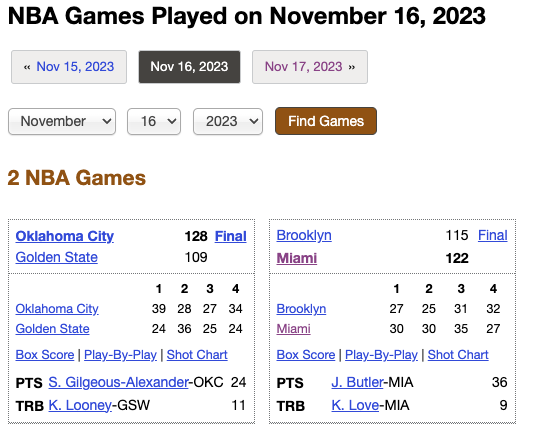

[](https://www.npmjs.com/package/@sahirb/nba-stats)

Making NBA data more accessible for fellow fanatics! 🏀 🤗

## **Installation**

```bash
npm install @sahirb/nba-stats
```

## **What can I use it for?**
🚦 No more getting rate limited by web apis

💰 Evaluate mid-game scenarios based on "similar" teams in past games/seasons as defined by you

🎶 Easily combine stats across seasons to find true historical outliers (both 🏆 && 🤮)


## **NBA Data 🧬 🧱**
Local copy of data with functions to access - with these building blocks the possibilities are endless! 😬


| Stat | Season | Notes |
| --- | --- | --- |
| Points per quarter | <code>[2003-2023 (20 seasons)]</code> | basketball-reference.com/boxscores
| Possessions per game | | basketball-reference.com/teams
| Offensive/defensive efficiency | | basketball-reference.com/boxscores
| Points per game | | derived from points per quarter
| Points per possession | | derived

... and some others you'd reasonably expect 🥳

Possible Future Data:
- Betting lines
- More seasons
- Advanced team/game stats (fouls, fg/ft/3fg attempts, etc.)
- Player Stats

If you have a request, check the previous README version for instructions on how to get priority 😆

If we want the top 3 offenses from the last 5 years:
```javascript
// offensiveEfficiencyRank: 3, pointsRank: 11
// guess which eastern conference team isn't good, just slow!?
// hint: 'the mecca of basketball' but not for the home team lol

[2022, 2021, 2020, 2019, 2018].forEach(year => {

    const sortedTop5 = bref.getSeasonSummaries(year)
    .filter(summary => {
        return summary.offensiveEfficiencyRank <= 5;
    }).map(summary => {
        return {
            teamName: summary.teamName,
            offensiveEfficiencyRank: summary.offensiveEfficiencyRank,
            pointsRank: summary.pointsScoredPerGameRank,
            offensiveEfficiency: summary.offensiveEfficiency,
            points: summary.pointsScoredPerGame,
            pace: summary.pace
        }
    }).sort((a, b) => {
        return a.offRank - b.offRank;
    });

    console.log(year);
    console.log(sortedTop3);
});

// -- result --
2022
[
  {
    teamName: 'Sacramento',
    offensiveEfficiencyRank: 1,
    pointsRank: 1,
    offensiveEfficiency: 119.4,
    points: 120.70731707317073,
    pace: 100.3
  },
  {
    teamName: 'Boston',
    offensiveEfficiencyRank: 2,
    pointsRank: 4,
    offensiveEfficiency: 118,
    points: 117.9390243902439,
    pace: 98.5
  },
  {
    teamName: 'New York',
    offensiveEfficiencyRank: 3,
    pointsRank: 11,
    offensiveEfficiency: 117.8,
    points: 116.02439024390245,
    pace: 97.1
  }
]
2021
[
  {
    teamName: 'Atlanta',
    offensiveEfficiencyRank: 2,
    ...
  }
]
...
```

If we want the game total & q2 difference for 2022 Lakers road losses (sorted by game total):
```javascript
const sortedLakers = bref.getSeasonScores(2022)
.filter(boxScore => {
    return
        boxScore.roadTeam === 'LA Lakers' &&
        boxScore.winningTeam !== 'LA Lakers';
}).sort((boxScoreA, boxScoreB) => {
    return
        boxScoreA.roadTeamTotal - boxScoreB.roadTeamTotal;
}).map(boxScore => {
    return {
        gameDate: boxScore.gameDate,
        roadTeamTotal: boxScore.roadTeamTotal,
        roatTeamSecondQuarter: boxScore.periodBreakdown[1].roadTotal
    }
});

console.log(sortedLakers);

// -- result --
[
  { date: '2022-12-28', total: 98, diff: -14, q2Diff: -1 },
  { date: '2022-10-26', total: 99, diff: -11, q2Diff: 4 },
  { date: '2022-11-9', total: 101, diff: -13, q2Diff: 15 },
  { date: '2022-10-28', total: 102, diff: -9, q2Diff: 3 },
  { date: '2022-12-6', total: 102, diff: -14, q2Diff: -7 },
  { date: '2022-12-19', total: 104, diff: -26, q2Diff: -10 },
  { date: '2023-1-30', total: 104, diff: -17, q2Diff: 1 },
  { date: '2022-11-22', total: 105, diff: -10, q2Diff: 6 },
  { date: '2022-10-18', total: 109, diff: -14, q2Diff: -4 },
  { date: '2023-1-9', total: 109, diff: -13, q2Diff: -8 },
  { date: '2023-2-28', total: 109, diff: -12, q2Diff: 7 },
  { date: '2023-3-15', total: 110, diff: -4, q2Diff: -2 },
  { date: '2022-12-7', total: 113, diff: -13, q2Diff: -15 },
  { date: '2022-12-25', total: 115, diff: -9, q2Diff: 4 },
  { date: '2023-2-13', total: 115, diff: -12, q2Diff: -4 },
  { date: '2022-11-7', total: 116, diff: -23, q2Diff: 3 },
  { date: '2023-4-5', total: 118, diff: -7, q2Diff: -13 },
  { date: '2022-12-21', total: 120, diff: -14, q2Diff: -9 },
  { date: '2023-1-28', total: 121, diff: -4, q2Diff: 7 },
  { date: '2022-12-9', total: 122, diff: -11, q2Diff: 9 },
  { date: '2023-2-4', total: 126, diff: -5, q2Diff: 9 }
]
```

To get all scores for one/more teams:
```javascript
const lakersThunder = bref.getSeasonScoresSimple(2022, ['LA Lakers', 'Oklahoma City']);

console.log(lakersThunder.length);
console.log(lakersThunder[0]);

// -- result --
160
{
  gameDate: '2021-10-19',
  roadTeam: 'Golden State',
  homeTeam: 'LA Lakers',
  ...
  winningTeamScore: 121,
  losingTeamScore: 114
}
```

Data Model
```javascript
BoxScore: {
    gameDate: string,
    numExtraPeriods: number,
    roadTeam: string,
    homeTeam: string,
    gameTotal: number,
    roadTeamTotal: number,
    homeTeamTotal: number,
    winningTeam: string,
    losingTeam: string,
    winningTeamScore: number,
    losingTeamScore: number,
    periodBreakdown: []PeriodBreakdown
}

PeriodBreakdown: {
    period: number,
    roadTotal: number,
    homeTotal: number
}
```

Functions
```javascript
getSeasonScores(season_start_year) => BoxScore[]

getSeasonScoresSimple(season_start_year, teams_to_include) => BoxScore[]

season_start_year: number

teams_to_include?: string[] // exclude to get all teams
```

## **Parse basketball-reference.com**
Parse basketball-reference.com for NBA data! 🏀 🧬

This was used to create the NBA Data! 🙏🏽

Currently supports getting game totals. For example, if we're interested in 2023-11-16
https://www.basketball-reference.com/boxscores/?month=11&day=16&year=2023



```javascript
const bref = require('@sahirb/basketball-reference')
bref.getBoxScores({
    year: 2023,
    month: 11,
    day: 16
});

// -- result --
{
  gameDate: '2023-11-16',
  numExtraPeriods: 0,
  periodBreakdown: [
    { period: 1, roadTotal: 39, homeTotal: 24 },
    { period: 2, roadTotal: 28, homeTotal: 36 },
    { period: 3, roadTotal: 27, homeTotal: 25 },
    { period: 4, roadTotal: 34, homeTotal: 24 }
  ],
  roadTeam: 'Oklahoma City',
  homeTeam: 'Golden State',
  gameTotal: 237,
  roadTeamTotal: 128,
  homeTeamTotal: 109,
  winningTeam: 'Oklahoma City',
  losingTeam: 'Golden State',
  winningTeamScore: 128,
  losingTeamScore: 109
},
{
    ... // NJ Nets at Miami
}
```

Data Model
```javascript
BoxScore: {
    gameDate: string,
    numExtraPeriods: number,
    roadTeam: string,
    homeTeam: string,
    gameTotal: number,
    roadTeamTotal: number,
    homeTeamTotal: number,
    winningTeam: string,
    losingTeam: string,
    winningTeamScore: number,
    losingTeamScore: number,
    periodBreakdown: []PeriodBreakdown
}

PeriodBreakdown: {
    period: number,
    roadTotal: number,
    homeTotal: number
}
```

Functions
```javascript
getBoxScores(date) => Promise<BoxScore[]>

date: {
    year: number,
    month: number,
    day: number
}
```
```javascript
getBoxScoresForDates(last_game_date, num_additional_days, file_path, box_score_transformation) => Promise<BoxScore[]>

last_game_date: {
    year: number,
    month: number,
    day: number
}

num_additional_days: number // additional days going back from last_game_date

file_path?: string // (optional) local file to save result to

box_score_transformation?: (BoxScore) => void // (optional) callback applied to each BoxScore in the response (and in the local file if file_path specified)
```

How to use - simple
```javascript
const bref = require('@sahirb/basketball-reference')

const date = {
    year: 2023,
    month: 11,
    day: 16
};

bref.getBoxScores(date).then(boxScores => {
    boxScores.forEach(boxScore => console.log(boxScore));
});

```

How to use - advanced (save multiple days to file with new 'feeling' column)
```javascript
const bref = require('@sahirb/basketball-reference')

const last_game_date = {
    year: 2023,
    month: 11,
    day: 16
};

const num_additional_days = 2;

const local_file_path = "/Users/boghani/basketball-reference-js-box-score/output_json.txt";

const box_score_transformation = (boxScore) => {
    let feeling = 'snooze fest';

    if (boxScore.gameTotal > 220) {
        feeling = 'wow points and stuff';

        if (boxScore.winningTeamScore - boxScore.losingTeamScore < 10) {
            feeling = 'be still my heart <4';
        }
    }

    boxScore.feeling = feeling;
};

bref.getBoxScoresForDates(last_game_date, num_additional_days, local_file_path, box_score_transformation).then(boxScores => {
    boxScores.forEach(boxScore => console.log(boxScore));
});

```
